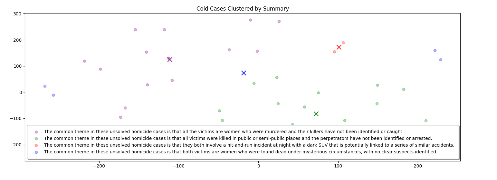

# Cold Case Clustering with OpenAI API

This project demonstrates how to use the OpenAI API to analyze and cluster summaries of unsolved homicide cases. It provides a means to visualize potential clusters within the cases, which could reveal patterns or similarities between them, potentially aiding further investigation.

## Overview

The program uses KMeans clustering to group case summaries based on their embeddings, generated via the OpenAI API. The resulting clusters are visualized in a 2D space using t-SNE. Each cluster is further analyzed to derive a common theme.

## Features

- **Embedding Generation**: Converts case summaries into embeddings using the OpenAI API.
- **Clustering**: Groups cases into clusters based on summary similarity using KMeans.
- **Visualization**: Plots clusters in a 2D space, using color coding to differentiate each cluster.
- **Label Generation**: Uses the OpenAI API to create descriptive labels for each cluster based on common themes in the case summaries.

## Setup

### Prerequisites

- Python 3.8+
- Dependencies listed in `requirements.txt`

### Installation

1. Clone this repository:
    ```bash
    git clone https://github.com/yourusername/ColdCaseClustering.git
    cd ColdCaseClustering
    ```
2. Install required packages:
    ```bash
    pip install -r requirements.txt
    ```
3. Add your OpenAI API key in a `secrets.json` file in the following format:
    ```json
    {
        "openai_key": "your_openai_api_key_here"
    }
    ```

4. Place your data file (`madeup_cases.json`) with unsolved case summaries in the `data/` directory. This file should be formatted as:
    ```json
    {
        "cold_case_summaries": [
            {
                "gender": "male",
                "location": "some place",
                "date": "YYYY-MM-DD",
                "summary": "Brief description of the case"
            },
            ...
        ]
    }
    ```

### Totally made up!
I used ChatGPT to generate the cold case summaries with a prompt like this:

_Create a JSON document containing 25 summaries of cold case homicides in Arizona, all occurring within the past 10 years. Each summary should be about 4 sentences long._

## Usage

Run the program with:

```bash
python main.py
```

The program will:
1. Load your API key and data.
1. Generate embeddings if not already cached.
1. Perform clustering.
1. Visualize clusters in a 2D plot with descriptive labels.

### Main Functions

- get_content_from_record: Formats a case record as a single text string.
- get_embedding: Gets an embedding vector for a given text using OpenAI.
- cluster_embeddings: Clusters embeddings into groups.
- plot: Visualizes the clusters using t-SNE.
- better_labels: Generates human-readable labels for each cluster.

### Example Visualization



The output is a plot showing clusters in distinct colors, with labels representing common themes for each group of cases.